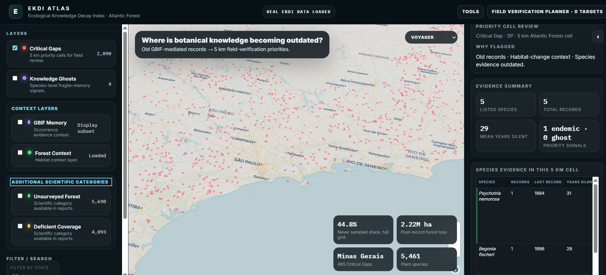

# EKDI Atlas

*Configurable methodology, interactive atlas, and reproducible workflow for GBIF-mediated botanical field verification under landscape change.*

[](https://GabrielaMoralesS.github.io/EKDI-atlas/app/)

[](LICENSE)


EKDI is a configurable workflow and interactive atlas for turning GBIF-mediated plant occurrence records into field-verification priorities under landscape change. The Atlantic Forest of Brazil is used as a case study.

## Why It Matters

The Atlantic Forest is one of the world's most threatened biomes, yet many botanical records still circulate without updated landscape interpretation. EKDI helps botanists decide where historical occurrence evidence may deserve renewed review when habitat change, sampling age, and biodiversity knowledge gaps overlap.

The current public demo focuses on the Atlantic Forest, but the approach is framed as adaptable rather than region-locked. EKDI is presented here as a reusable workflow built around configurable inputs, documented provenance, and explicit biome-specific assumptions.

## What EKDI Adds to GBIF

| GBIF occurrence maps | EKDI Atlas |
| --- | --- |
| Shows where records were documented | Prioritizes where old occurrence evidence may need field review |
| Focuses on occurrence availability | Adds habitat-change context and knowledge obsolescence |
| Species points are the main output | Critical Gaps and Knowledge Ghosts support field verification planning |

## Core Concepts

- **Critical Gap:** a 5 km cell where botanical evidence may deserve field verification priority.
- **Knowledge Ghost:** a species-level fragile-evidence signal for expert review.
- **Field Verification Output:** exported checklists and summaries for planning follow-up work.

## Workflow

```text
GBIF records → 5 km grid → sampling antiquity → habitat-change context
→ richness deficit → Critical Gaps → Knowledge Ghosts → Field Outputs
```

## Atlas Views




## Live Demo

[https://GabrielaMoralesS.github.io/EKDI-atlas/app/](https://GabrielaMoralesS.github.io/EKDI-atlas/app/)

## Quick Start

```bash
python -m http.server 8000
```

Open:

```text
http://localhost:8000/app/
```

## Reproducibility

A clean clone can run the final Atlantic Forest atlas from processed outputs already bundled in `app/data/`. Configurable reruns and deeper recomputation depend on intermediate or external inputs that are documented explicitly instead of assumed.

EKDI should be read as a configurable methodology, an interactive atlas, and a reusable workflow. The Atlantic Forest case study demonstrates the approach; adapting it to another biome requires GBIF occurrence data, a target grid, land-cover or habitat-change layers, and case-appropriate parameters.

- [Methodology](docs/methodology.md)
- [Reproducibility](docs/reproducibility.md)
- [Data Sources](docs/data_sources.md)
- [Limitations](docs/limitations.md)

Sample reproducibility demo: run the provided GBIF/Darwin Core-like CSV through the input-readiness pipeline.

Open the **Scientific Report** inside the live demo for the current case-study report.

## Limitations

- EKDI is a decision-support atlas, not a claim of presence, absence, extinction, or rediscovery.
- The browser app visualizes processed outputs and does not recompute EKDI client-side.
- Full scientific recomputation requires external or locally generated intermediate inputs not bundled in the public repository.
- Atlantic Forest weights are a case-study preset and should be recalibrated before use in another biome.

## Citation

See [CITATION.cff](CITATION.cff).

## License

Code is released under the MIT License. Data files retain the licenses of their original sources.
