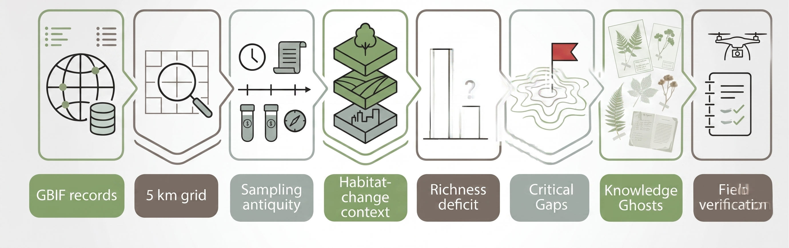

# EKDI Atlas — Ecological Knowledge Decay Index

*Identifying where GBIF-mediated botanical records may have become ecologically outdated*

[](https://GabrielaMoralesS.github.io/EKDI-atlas/app/)

[](LICENSE)

[](https://doi.org/10.15468/dl.evgrnx)


## The Problem

GBIF holds over 2 billion occurrence records. Many were collected decades before the deforestation events that followed. In the Atlantic Forest of Brazil alone, **2.22 million hectares of forest were lost after the botanical records describing those areas were collected** , yet those records are still reused today as if the landscape they describe were unchanged.

**EKDI makes that gap visible and turns it into a field-verification priority layer.**

## What EKDI Found

Running the EKDI pipeline against GBIF-mediated plant occurrence data for the Atlantic Forest identified:

- **2,090 Critical Gap cells** on a 5 km grid, where old botanical evidence overlaps with significant post-record forest loss context.
- **4 Knowledge Ghost species** — plants represented in the current EKDI build by very limited GBIF-mediated evidence linked to cells with strong post-record habitat-change context.

| Species | Last GBIF record | Forest lost since |
| --- | --- | --- |
| *Varronia neowediana* | 2000 | 1.1k ha |
| *Adenocalymma fistulosum* | 2003 | 1.3k ha |
| *Bromus commutatus* | 1986 | 1.3k ha |
| *Bothriochloa longipaniculata* | 1986 | 800 ha |

A Knowledge Ghost is not a claim of extinction, absence, rediscovery, or current persistence. It is a signal that field or herbarium review may be overdue.

## What EKDI Adds to GBIF

| GBIF occurrence maps | EKDI Atlas |
| --- | --- |
| Show **where** records were documented | Prioritize **where old evidence needs review** |
| Treat all occurrence records as current | Adds habitat-change context after the record was collected |
| Species points are the main output | Critical Gaps, Botanical Memory profiles, Knowledge Ghosts and field outputs are the main outputs |
| A download is usually the starting point | EKDI turns a GBIF download into a field-verification workflow |

## What You Can Do in the App
EKDI is not only a map. It is an interactive workflow for turning old botanical evidence into reviewable field priorities.

In the live atlas, users can:

- Explore Critical Gap cells across the Atlantic Forest case study;
- Click any priority cell and see why it was flagged;
- Inspect cell-level evidence such as last record year, years silent, forest remaining, post-record   forest loss and richness deficit.
- Review plant records linked to the selected grid cell.
- Open  Botanical Memory profiles for species-level review.
- Add cells or species to a field-verification planner.
- Open nearby iNaturalist observations for community context.
- Open the selected cell in Google Maps for field orientation.
- Export field-verification checklists and evidence tables with provenance.
- Use Data Readiness Check to test whether a GBIF/Darwin Core-like occurrence table contains the minimum fields required for EKDI-style analysis.

iNaturalist links are provided for community observation context only. EKDI does not treat them as formal herbarium verification, voucher evidence or proof of current presence.


## Try It With Your Own GBIF Data

EKDI is not only a finished Atlantic Forest map. Inside the live app, **Data Readiness Check** lets users upload a GBIF/Darwin Core-like occurrence table and check whether it contains the minimum fields required for EKDI-style analysis: scientific names, coordinates, and dates.

This browser-based readiness check does not recompute the full EKDI atlas. It helps users understand whether their occurrence data are ready to be combined with a target grid, habitat-change layers, and calibrated parameters in the reproducible EKDI workflow described below.

## How It Works

```text
GBIF records → 5 km grid → sampling antiquity → habitat-change context
→ richness deficit → Critical Gaps → Knowledge Ghosts → Field Outputs
```



EKDI score = weighted combination of **sampling antiquity** (how old is the evidence), **post-record forest loss** (how much habitat changed since), and **richness deficit** (how undersampled the area is relative to expectation). Full formula and weights are documented in [Methodology](docs/methodology.md) and visible live in the app's Scientific Report.

## Inside the EKDI Atlas


*2,090 Critical Gap cells across the Atlantic Forest, ranked by EKDI score.*


*Clicking a cell opens transparent evidence: last GBIF-mediated record, years silent, forest remaining, post-record forest loss, richness deficit and linked plant records.*


*Exportable, citation-ready field-verification checklists for botanists and herbaria.*

## Live Demo

**[Open the EKDI Atlas →](https://GabrielaMoralesS.github.io/EKDI-atlas/app/)**

No installation required. Built with MapLibre GL JS, runs entirely client-side from processed open data.

## Reproducibility — Three Honest Levels

This repository documents exactly what can and cannot be reproduced from the public clone alone — no overstated claims:

| Level | What it does | Status |
| --- | --- | --- |
| **1 — Run the atlas** | Loads the final Atlantic Forest atlas from processed outputs already bundled in `app/data/` | ✅ Supported from clean clone |
| **2 — Run the configurable pipeline** | Regenerates EKDI-style outputs from intermediate inputs via `python scripts/run_ekdi_pipeline.py --config configs/atlantic_forest.json` | ✅ Supported when local inputs exist |
| **3 — Full recomputation from raw GBIF data** | Re-derives the analytical grid and habitat-change layers from scratch | ⚠️ Requires external/local intermediate inputs — see [Data Sources](docs/data_sources.md) |

Want to test the pipeline right now without any setup?

```bash
python scripts/run_ekdi_pipeline.py --sample-demo
```

This runs a real GBIF/Darwin Core-style occurrence readiness check against a bundled sample CSV — no external data needed.

GBIF source data DOI: **[10.15468/dl.evgrnx](https://doi.org/10.15468/dl.evgrnx)**

- [Methodology](docs/methodology.md) — The EKDI formula, weights, and scoring logic
- [Reproducibility](docs/reproducibility.md) — Full breakdown of the three levels above
- [Data Sources](docs/data_sources.md) — Every input file, its provenance, and whether it's bundled
- [Limitations](docs/limitations.md) — What EKDI does *not* claim

## Beyond the Atlantic Forest

The Atlantic Forest is the demonstration case study, not the ceiling of the approach. EKDI is built as a configurable workflow (`configs/*.json`) intended for adaptation to other threatened biomes. Candidate next pilots include the Cerrado and Sundaland, provided that occurrence data, grid layers, habitat-change data, and expert calibration are available for each.

Future work also includes integrating species distribution modelling (SDM) to improve habitat-suitability and expected-richness support, and exploring PlantBERT-style botanical language models for vegetation or phytophysiognomy inference as part of related graduate research.

These directions are not part of the current public EKDI Atlas build. They are planned extensions that could strengthen future versions of the workflow once additional data, validation, and expert calibration are available.

### Limitations

- EKDI is a decision-support atlas, not a claim of species presence, absence, extinction, or rediscovery.
- The browser app visualizes processed outputs and does not recompute EKDI client-side.
- EKDI does not auto-update when new GBIF occurrence releases are published — updating requires re-running the pipeline (Level 2/3 above) against a new download.
- Atlantic Forest weights are a case-study preset and should be recalibrated before use in another biome.

Full list: [Limitations](docs/limitations.md)

## Acknowledgements

This work was developed at the Instituto de Computação, Universidade Estadual de Campinas (UNICAMP), Brazil, with support from the Hub de Inteligência Artificial e Arquiteturas Cognitivas (H.IAAC), Meta 5, and the Fundação de Desenvolvimento da Unicamp (FUNCAMP).

The author thanks the Visual Informatics Laboratory and the academic supervisors and collaborators who contributed guidance during the development of this project.

## Author / Contact

**Gabriela Morales Soto**
M.Sc. student in Computer Science
Instituto de Computação, Universidade Estadual de Campinas (UNICAMP)
Campinas, São Paulo, Brazil

GitHub: [@GabrielaMoralesS](https://github.com/GabrielaMoralesS)
Email: [g299213@dac.unicamp.br](mailto:g299213@dac.unicamp.br)

Questions, feedback, or collaboration inquiries about EKDI are welcome via email or by opening an issue in this repository.

## Citation

If you use EKDI or its outputs, please cite:

> Morales Soto, G. (2026). *EKDI Atlas — Ecological Knowledge Decay Index.* GBIF Ebbe Nielsen Challenge 2026. Instituto de Computação, Universidade Estadual de Campinas (UNICAMP), Av. Albert Einstein, 1251, Cidade Universitária “Zeferino Vaz”, Barão Geraldo, 13083-852, Campinas, São Paulo, Brazil.

Machine-readable citation: [CITATION.cff](CITATION.cff)


## License

Code is released under the MIT License. Data files retain the licenses of their original sources (GBIF, MapBiomas, FloraBR — see [Data Sources](docs/data_sources.md)).


