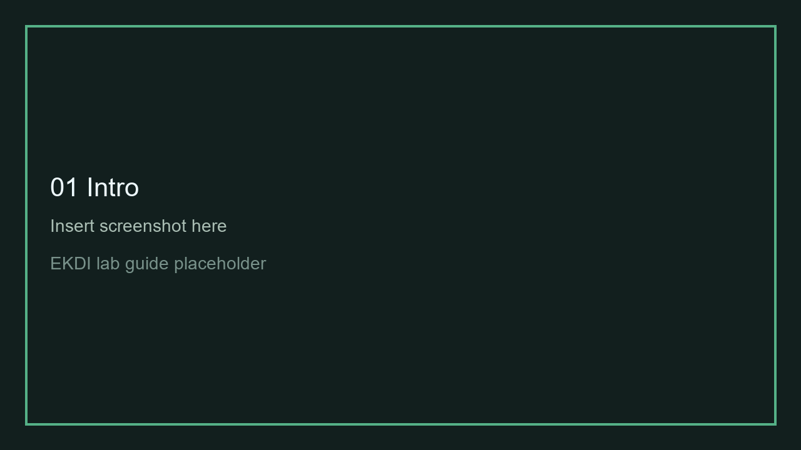
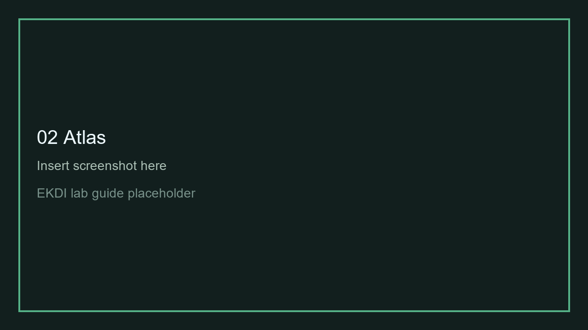
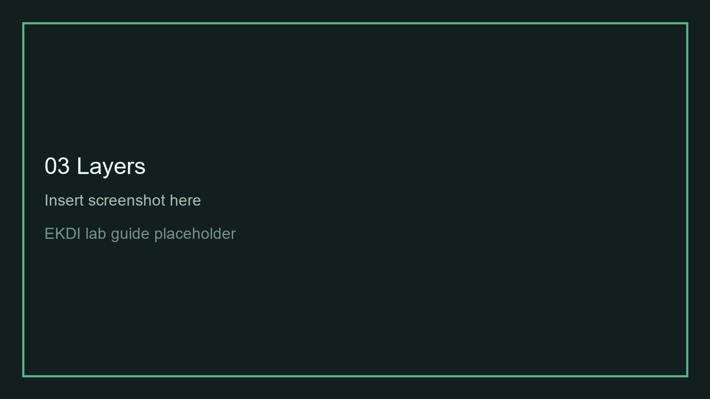
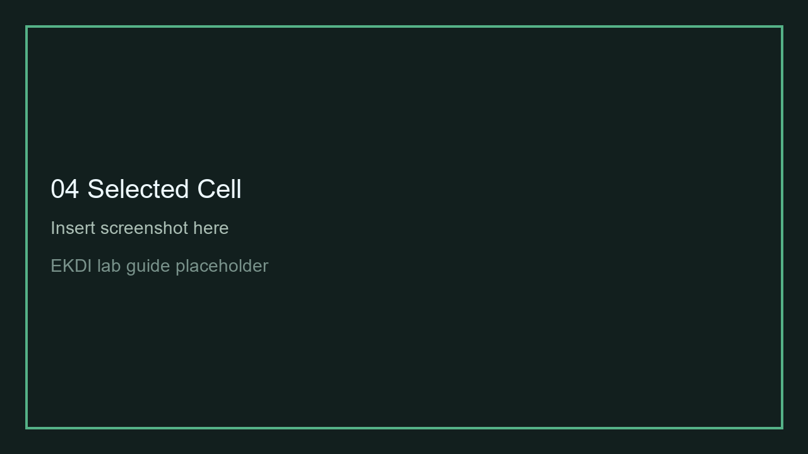
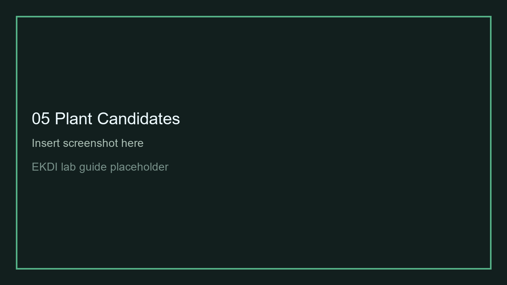
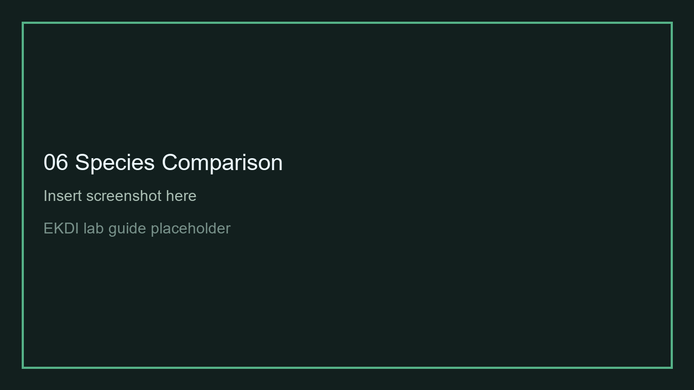
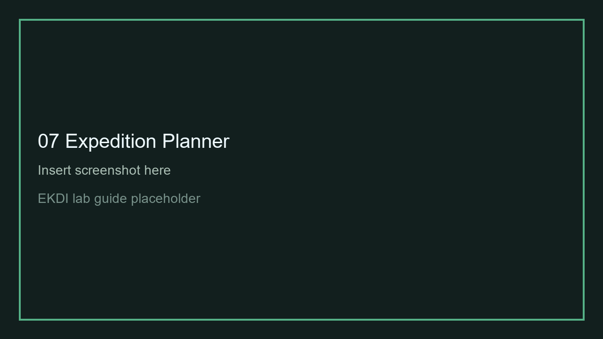
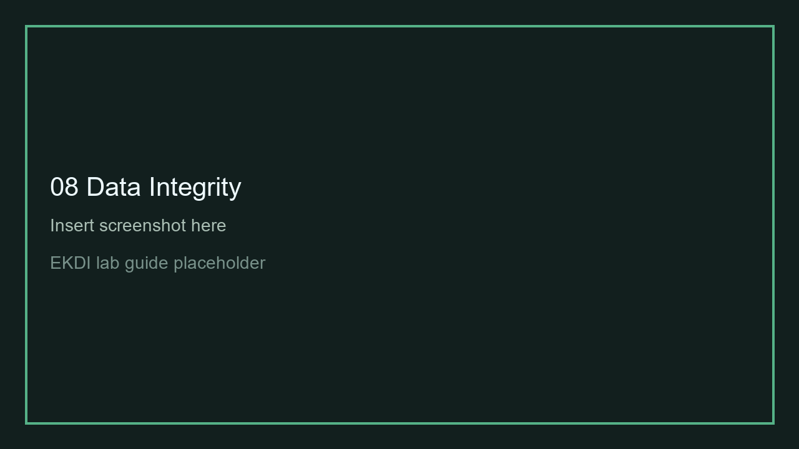

# Guia De Laboratório — EKDI Mata Atlântica

Público: membros do laboratório, professor, estudantes de biologia e ecologia.

## O Que É O EKDI

EKDI é um atlas de apoio à decisão para transformar registros de biodiversidade, mudança de paisagem e lacunas de conhecimento em perguntas de verificação botânica.



Inserir screenshot aqui.

## Que Problema Ele Aborda

Registros de ocorrência preservam memória ecológica, mas a paisagem ao redor desses registros pode mudar. EKDI ajuda a localizar onde essa memória precisa de revisão em campo.

## O Que Já Está Funcional

- Intro cinematográfica.
- Mapa MapLibre com dados reais limpos.
- Critical Gaps, Unsurveyed Forest, Deficient Coverage e Historical Review.
- Painel de célula selecionada.
- Evidence Completeness.
- Botanical Evidence Summary.
- Plant Candidates quando há vínculo real por célula.
- Expedition Planner.
- Data Integrity & Validation.
- About EKDI e Judge Demo.



Inserir screenshot aqui.

## O Que Ainda É Protótipo

- Geração de atlas por upload.
- Comparação com herbários externos.
- Validação Flora e Funga.
- Integração speciesLink.
- Sensibilidade dos pesos EKDI.
- Publicação web otimizada para grandes camadas.

## Como Abrir O App

No terminal:

```bash
cd repo/app
python -m http.server 8000
```

Abrir:

```text
http://localhost:8000/
```

Não abrir o HTML com duplo clique.

## Roteiro De 10 Minutos

1. Abrir a intro e entrar no atlas.
2. Clicar em `Judge Demo`.
3. Observar Critical Gaps no mapa.
4. Selecionar uma célula crítica.
5. Ler `Why This Cell?`.
6. Ver Plant Candidates, se disponíveis.
7. Abrir `Compare Records`.
8. Adicionar célula ao Expedition Planner.
9. Abrir Data Integrity & Validation.
10. Discutir limitações e próximos dados necessários.



Inserir screenshot aqui.

## O Que Cada Ferramenta Faz

- Map Layers: liga e desliga camadas de prioridade.
- Selected Cell Panel: mostra evidência da célula.
- Plant Candidates: lista plantas ligadas por `cell_id`, quando existem.
- Compare Species Records: resume evidência disponível para uma planta selecionada.
- Botanical Evidence Summary: organiza sinais botânicos e recomendações.
- Expedition Planner: monta uma lista de verificação de campo.
- Data Integrity: mostra limites, incertezas e validação necessária.

## Como Interpretar Uma Célula

Veja primeiro:

- classe EKDI;
- estado;
- última evidência;
- cobertura florestal;
- perda florestal pós-registro;
- número de registros GBIF;
- recomendação.

Depois veja os detalhes botânicos.



Inserir screenshot aqui.

## Como Interpretar Plant Candidates

Plant Candidates são sinais de evidência botânica ligados à célula.

Eles não confirmam ocorrência atual. Devem orientar:

- revisão de voucher;
- checagem de coordenadas;
- consulta a herbários;
- validação taxonômica;
- possível verificação de campo.



Inserir screenshot aqui.

## Como Usar Species Evidence Comparator

Abra `Compare Records` em uma planta candidata.

O comparador mostra:

- espécie;
- tipo de candidato;
- último registro GBIF;
- número de registros;
- risco, se disponível;
- perda florestal, se disponível;
- cobertura florestal, se disponível;
- Evidence Completeness;
- recomendação.

Se não há fonte externa real, o app recomenda comparação com herbários.



Inserir screenshot aqui.

## Como Usar Expedition Planner

Adicione células e espécies candidatas.

Use o planner para:

- revisar vouchers;
- confirmar coordenadas;
- checar remanescentes florestais;
- planejar fotos de habitat;
- procurar plantas alvo;
- exportar CSV e JSON.



Inserir screenshot aqui.

## Data Integrity

Use esta seção para discutir:

- limitações dos dados GBIF;
- incerteza espacial;
- ausência de algumas fontes opcionais;
- validação por especialistas;
- necessidade de análise de sensibilidade.



Inserir screenshot aqui.

## Feedback Solicitado

- O conceito está claro?
- As categorias do mapa fazem sentido?
- Plant Candidates ajudam botanicamente?
- O comparador de registros é útil?
- Quais fontes precisam entrar primeiro?
- O que seria necessário antes de usar em campo?

## Next Steps

Near-term:

- validar o vínculo de Plant Candidates;
- melhorar Species Record Comparison;
- conectar herbários ou speciesLink quando possível;
- adicionar validação Flora e Funga;
- refinar o checklist de campo;
- coletar feedback de especialistas.

Medium-term:

- fazer análise de sensibilidade dos pesos EKDI;
- validar com áreas de coleta conhecidas;
- testar GitHub Pages publicamente;
- preparar materiais de submissão ao GBIF.
